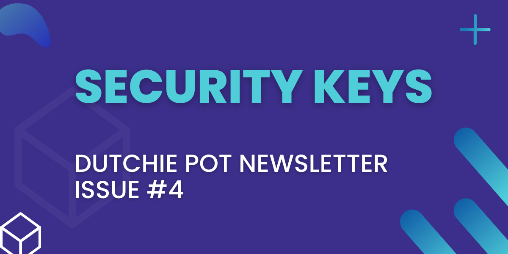

> **Note!** This is a copy and paste of my newsletter entry that was originally posted on Substack. I have since removed my newsletter from Substack.

Hello there and welcome to issue #4 of the Dutchie Pot Newsletter. In this issue, we will be talking about Security keys. Without further ado, let's get into it.

## What are Security Keys?

So, what are Security keys? A security key is a physical device that you use to log into your online accounts. They're easy to set up and don't require any extra work. The device can be plugged into your computer or smartphone, and you're good to go. Several websites already support security keys, so you can start using them immediately. With a security key, can help you be confident that your accounts are safe.

## What are the benefits of Security Keys?

Security keys are an excellent way to protect your accounts from hackers and other malicious actors. They are easy to use and do not require any additional software or installation. They are also much more secure than passwords alone because they are not vulnerable to brute force attacks. You don't have to worry about getting a new security key for all your different accounts because they can be used across multiple accounts and devices.

## What are the downsides of Security Keys?

Security keys can be easily lost, so it is important to keep them safe. Your device may need to have specific ports or hardware to be used. Furthermore, not every website or app supports security keys, so you may need to search for alternatives if the service you use doesn't. Security keys are not free and can cost anywhere from a few dollars to around $70, so you may have to spend a few extra dollars to get one.

## Where to get them?

You can purchase security keys from places like Amazon or Best Buy. But they can get it directly from yubico.com, which is the official website for YubiKeys, a popular type of security key. They have several models available with different features and price ranges. Some websites may offer discounts or even free security keys if you are an existing customer.

## Fin

Thanks for reading, and see you next time for another issue of the Dutchie Pot Newsletter.
